## I'm Gabriel Frasão • Full-Stack Web dev :muscle:

Just a non-ordinary, ambitious and self-taught web dev student.

Take a look at what I've been up to [right here](https://github.com/users/gabe-frasz/projects/3/views/1).

## :brain: My tech stack

> Video made with [Remotion](https://remotion.dev) in [this repo](https://github.com/gabe-frasz/onlytechstacks)

  
Text version

  - **Languages**: TypeScript, JavaScript, Go
  - **Frameworks**: React, Next.js, Astro
  - **Tools**: Bun, Tailwind, Vitest, Cypress, Docker 
  - **DB**: PostgreSQL

## :gear: GitHub Analytics

## :phone: Contact

Get in touch with me on:

